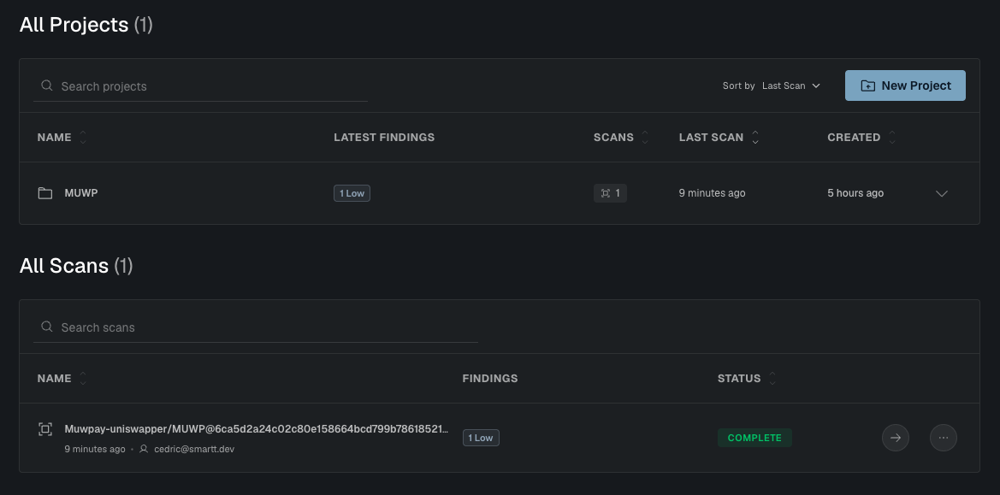

# Deliverable 3 — Soroban Smart Contract Integration

**Status:** Complete  
**Branch:** `main`

---

## Grant Requirements

> Functional APIs for subscription workflows using Soroban contracts. Comprehensive documentation and example integrations.

---

## Smart Contract

**Source:** `contracts/soroban/src/lib.rs`  
**Status:** Deployed and validated on testnet.  
**Network:** Stellar Testnet  
**Soroban SDK:** `25.3.1`  
**Build:** `wasm32v1-none` (stellar-cli 26.0)

### Testnet deployment

| Field | Value |
|---|---|
| Contract ID | [`CAH3T7NSZMZTX2KPKK5IKKMCKE4ZDYVK4OO64OISB6OY7W3OLS6OJJMP`](https://stellar.expert/explorer/testnet/contract/CAH3T7NSZMZTX2KPKK5IKKMCKE4ZDYVK4OO64OISB6OY7W3OLS6OJJMP) |
| WASM hash | `5f72dd9ce62f3c7e3f7c21d428c5a1e7284edbbdeae9a7ec3e3727a6b98ef285` |
| Upload tx | [`fa3402c8…`](https://stellar.expert/explorer/testnet/tx/fa3402c87d89f1cc01cb602477be456cd118711e3c2525ecf0ef3bd0cb0e2fc1) |
| Deploy tx | [`86be0ca7…`](https://stellar.expert/explorer/testnet/tx/86be0ca7eaba38a3611817f610219cbb3dd57145db9352e039da83435523b698) |

### Testnet lifecycle validation

The full subscription flow was exercised end-to-end on testnet against the deployed contract. The `trigger` transaction emitted a real `transfer` event from the XLM SAC: subscriber → recipient, `10000000` stroops (1 XLM), pulled by the contract via `transfer_from`.

| Action | Result | Tx hash |
|---|---|---|
| `create` (subscriber, XLM SAC, recipient, 1 XLM, 60s) | id `1` returned, `Create` event emitted | [`71aa2744…`](https://stellar.expert/explorer/testnet/tx/71aa2744a1e84b1ce118330b6409644b012f5da1722485dcf2e8e0401d767b3e) |
| `approve` (XLM SAC → contract, 100 XLM) | allowance set | [`e3d66eab…`](https://stellar.expert/explorer/testnet/tx/e3d66eab49b835e74cba23f72185e97c86b54958a283e35eb4f5a6ff486bff94) |
| `trigger` (after 60s) | **1 XLM transferred on-chain**, `Trigger` event emitted | [`62622e13…`](https://stellar.expert/explorer/testnet/tx/62622e133f3cd30c6daf78df5b4f42c1b219103f8994a585a0d90c4090998ad4) |
| `cancel` | `active=false`, `Cancel` event emitted | [`4fa14ecf…`](https://stellar.expert/explorer/testnet/tx/4fa14ecf60df945ad63c5027c316f550675bcae543d680444956be679eab10e1) |

**Subscriber:** `GBZCJYXOJ5U26Q5PCZJ3G5VBBRUHU7ZPMY3JCXGSCFF4WZQYS46ZKNVD`  
**Recipient:** `GBYTXEWYKEYSCJEYCRO7P7WPZSWNWLOS7LNXBPA3Q7USHHRQW2ZERQY3`  
**Token (native XLM SAC):** `CDLZFC3SYJYDZT7K67VZ75HPJVIEUVNIXF47ZG2FB2RMQQVU2HHGCYSC`

### Contract interface

#### Lifecycle

| Function | Arguments | Returns | Auth |
|---|---|---|---|
| `__constructor(owner)` | `Address` | — | `owner` (atomic at deploy) |
| `create(subscriber, token, recipient, amount, interval)` | `Address × Address × Address × i128 × u64` | `u64` (subscription id) | `subscriber` |
| `trigger(id)` | `u64` | — | permissionless |
| `trigger_n(id, count)` | `u64 × u32` | — | permissionless |
| `cancel(id)` | `u64` | — | `subscriber` |
| `get(id)` | `u64` | `Subscription` | — |

#### Admin (owner-only)

| Function | Arguments | Returns | Auth |
|---|---|---|---|
| `pause()` / `unpause()` | — | — | `owner` |
| `transfer_ownership(new_owner)` | `Address` | — | `owner` **and** `new_owner` (atomic 1-step) |
| `upgrade(new_wasm_hash)` | `BytesN<32>` | — | `owner` |

### Subscription struct

```rust
pub struct Subscription {
    pub subscriber: Address,
    pub token: Address,
    pub recipient: Address,
    pub amount: i128,
    pub interval: u64,     // seconds between payments (1..=MAX_INTERVAL = 10 years)
    pub next_payment: u64, // Unix timestamp, anchored on the schedule (no drift)
    pub active: bool,
}
```

### Payment flow

The contract uses the `transfer_from` pattern: the subscriber must first call `token.approve(contract_address, amount)` to authorize the contract to pull tokens. `trigger()` and `trigger_n()` can then be called by anyone (keeper, recipient, bot) once the payment is due — the allowance is the consent.

Key invariants:

- **No drift**: `next_payment` advances by exactly `interval` per cycle, anchored on the schedule, not on the wall-clock time of the trigger.
- **Catch-up**: when `n` cycles have been missed, call `trigger_n(id, n)` to settle them atomically in a single `transfer_from`. The contract silently caps at `min(count, due_cycles)`.
- **Recipient locked at creation**: prevents a third-party caller from redirecting funds.

### Security design

The contract was scanned with [Almanax.ai](https://almanax.ai), an automated security auditor for Soroban smart contracts. The scan completed with **1 Low severity finding** — no Medium, High, or Critical issues were detected. The Low finding (governance TTL not refreshed by user calls) was addressed before testnet deployment: `Owner` and `Paused` TTLs are now bumped inside `require_not_paused` and `require_owner`, so every user call (`create`, `trigger`, `trigger_n`) keeps the governance state alive without requiring periodic admin intervention.



The measures below are implemented in `contracts/soroban/src/lib.rs` and each has dedicated regression tests in the embedded Rust suite.

**Reentrancy & state safety.** `trigger` and `trigger_n` follow the *checks-effects-interactions* pattern: the subscription's `next_payment` is persisted before the external `transfer_from` call, so a malicious (subscriber-supplied) token contract cannot reenter and double-pull a cycle.

**Overflow safety.** `interval` is bounded to `1..=MAX_INTERVAL` (10 years) at creation. Every arithmetic step on `next_payment`, cycle counts and total amounts uses `checked_add` / `checked_mul` and surfaces a dedicated `ArithmeticOverflow` error instead of silent wrap.

**Atomic initialization.** Ownership is set by a Soroban `__constructor`, invoked exactly once at deployment. This closes the front-running window that a two-step `deploy` + `initialize` flow would expose.

**Access control.** Admin entrypoints (`pause`, `unpause`, `transfer_ownership`, `upgrade`) are owner-gated. `transfer_ownership` is atomic and requires signatures from BOTH the current owner and the new owner in the same transaction — a wrong or compromised target address cannot be set without it explicitly authorising the transfer (the wrong key cannot sign). `trigger` and `trigger_n` are explicitly permissionless — the subscriber's allowance is the consent, and the recipient is locked at creation so funds cannot be redirected.

**Address validation.** `create` rejects `token == self` and `recipient == self` to avoid stranded funds or recursive `transfer_from` calls on the contract itself.

**Upgradability.** `upgrade(new_wasm_hash)` lets the owner hot-swap the contract WASM for bug fixes. It is intended to be used together with `pause` and off-chain review of the hash.

**Persistent ID counter.** The subscription ID counter lives in persistent storage, so IDs keep incrementing strictly even if instance storage expires — ruling out collisions with still-persistent subscriptions.

**Persistent, fail-closed governance state.** `Owner` and `Paused` live in persistent storage (not instance storage) and their TTL is bumped on every admin write. If the `Paused` entry is ever missing, `require_not_paused` panics with `NotInitialized` rather than defaulting to *unpaused*. This closes an Almanax MEDIUM finding: with instance storage + `unwrap_or(false)`, a long emergency-pause window with no successful calls to bump TTL could have silently expired the flag and resumed `create` / `trigger` while admin entrypoints simultaneously became unusable.

**Observability.** Every admin action emits a typed event (`init`, `pause`, `unpause`, `own_xfer`, `upgrade`) for off-chain indexers and monitoring.

### Embedded Rust tests

```bash
cd contracts/soroban && cargo test
```

```
running 37 tests
test tests::test_create_returns_id ... ok
test tests::test_get_subscription ... ok
test tests::test_cancel_subscription ... ok
test tests::test_trigger_after_interval ... ok
test tests::test_trigger_no_drift ... ok
test tests::test_trigger_is_permissionless ... ok
test tests::test_trigger_before_due_fails - should panic ... ok
test tests::test_trigger_after_cancel_fails - should panic ... ok
test tests::test_pause_prevents_create - should panic ... ok
test tests::test_pause_prevents_trigger - should panic ... ok
test tests::test_pause_without_owner_auth_fails - should panic ... ok
test tests::test_unpause_allows_trigger ... ok
test tests::test_create_zero_amount_fails - should panic ... ok
test tests::test_create_negative_amount_fails - should panic ... ok
test tests::test_create_zero_interval_fails - should panic ... ok
test tests::test_create_interval_too_large_fails - should panic ... ok
test tests::test_create_interval_u64_max_fails - should panic ... ok
test tests::test_create_interval_at_max_bound_succeeds ... ok
test tests::test_create_recipient_is_contract_fails - should panic ... ok
test tests::test_create_token_is_contract_fails - should panic ... ok
test tests::test_double_cancel_is_idempotent ... ok
test tests::test_counter_increments_monotonically ... ok
test tests::test_transfer_ownership_succeeds ... ok
test tests::test_transfer_ownership_without_owner_auth_fails - should panic ... ok
test tests::test_transfer_ownership_without_new_owner_auth_fails - should panic ... ok
test tests::test_upgrade_requires_owner - should panic ... ok
test tests::test_trigger_n_catches_up_multiple_cycles ... ok
test tests::test_trigger_n_caps_at_due_cycles ... ok
test tests::test_trigger_n_one_matches_trigger ... ok
test tests::test_trigger_n_zero_count_fails - should panic ... ok
test tests::test_trigger_n_before_due_fails - should panic ... ok
test tests::test_trigger_n_after_cancel_fails - should panic ... ok
test tests::test_trigger_n_when_paused_fails - should panic ... ok
test tests::test_trigger_n_is_permissionless ... ok
test tests::test_trigger_fails_closed_when_paused_entry_missing - should panic ... ok
test tests::test_create_fails_closed_when_paused_entry_missing - should panic ... ok
test tests::test_pause_fails_when_owner_entry_missing - should panic ... ok

test result: ok. 37 passed; 0 failed
```

---

## SDK Service

**File:** `packages/sdk/src/services/SorobanSubscriptionService.ts`

> **Contract surface coverage:** the four core methods shown below (`create`, `trigger`, `cancel`, `get`) cover the primary subscription lifecycle. SDK bindings for the additional contract entrypoints (`trigger_n`, `pause`, `unpause`, `transfer_ownership`, `upgrade`) are available directly via the Stellar CLI or the Soroban SDK for advanced use cases.


```typescript
import { SorobanSubscriptionService } from "@muwp/sdk";
import { Networks } from "@stellar/stellar-sdk";

const service = new SorobanSubscriptionService({
  sorobanUrl: "https://soroban-testnet.stellar.org",
  networkPassphrase: Networks.TESTNET,
});

// Create a recurring subscription: 10 USDC every hour
const id = await service.createSubscription({
  contractId: "C...",
  callerSecret: "S...",
  token: "CBIELTK6YBZJU5UP2WWQEUCYKLPU6AUNZ2BQ4WWFEIE3USCIHMXQDAMA",
  recipient: "G...",
  amount: 10_000_000n,   // 10 tokens with 6 decimals
  intervalSeconds: 3600,
});

// Trigger the payment when due
const txHash = await service.triggerPayment({
  contractId: "C...",
  callerSecret: "S...",
  subscriptionId: id,
});

// Cancel the subscription
await service.cancelSubscription({
  contractId: "C...",
  subscriberSecret: "S...",
  subscriptionId: id,
});

// Read a subscription
const sub = await service.getSubscription("C...", id);
console.log(sub.active, sub.nextPayment);
```

### Methods

| Method | Parameters | Returns |
|---|---|---|
| `createSubscription(params)` | `CreateSubscriptionParams` | `Promise<number>` (id) |
| `triggerPayment(params)` | `TriggerPaymentParams` | `Promise<string>` (tx hash) |
| `cancelSubscription(params)` | `CancelSubscriptionParams` | `Promise<string>` (tx hash) |
| `getSubscription(contractId, id)` | `string, number` | `Promise<Subscription>` |

---

## Tests

**File:** `packages/sdk/tests/subscription.spec.ts`

```
✓ createSubscription: calls sendTransaction and returns a subscription id
✓ createSubscription: throws when simulation returns an error
✓ cancelSubscription: sends a cancel transaction and returns the hash
✓ triggerPayment: sends a trigger transaction and returns the hash
```

```bash
cd packages/sdk && bun run test tests/subscription.spec.ts
```

---

## Example

**File:** `packages/sdk/examples/04-soroban-subscription.ts`

```bash
cd packages/sdk

# Offline mode (demo — every step prints an expected network error)
bun run examples/04-soroban-subscription.ts

# With real testnet keys
SUBSCRIBER_SECRET=S... CONTRACT_ID=C... bun run examples/04-soroban-subscription.ts
```

---

## File layout

```
contracts/soroban/
├── Cargo.toml
└── src/lib.rs                         ← Soroban contract (Rust)

packages/sdk/
├── src/
│   ├── services/
│   │   └── SorobanSubscriptionService.ts   ← SDK service
│   └── types/
│       └── subscription.ts                 ← Types + Zod schemas
├── tests/
│   └── subscription.spec.ts               ← 4 unit tests
└── examples/
    └── 04-soroban-subscription.ts         ← End-to-end example
```
