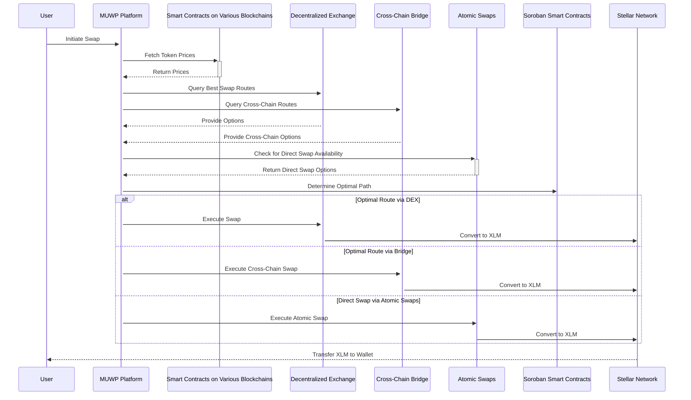

# Technical Architecture Diagram

---

## Multi-Path Swap Process with MUWP for Stellar

This sequence diagram illustrates the process a user goes through to perform a token swap using MUWP, facilitating swaps across various blockchains to find the most optimal route.

### Step-by-Step Breakdown

**1. User Initiates Swap**
The user specifies the desired source/destination tokens and the amount to be swapped.

**2. MUWP Fetches Token Prices**
The platform interacts with smart contracts on various blockchains to access current token prices or exchange rates.

**3. MUWP Queries Swap Routes**
Two routes are evaluated in parallel:
- **Decentralized Exchanges (DEXs):** Best exchange routes within the user's chosen blockchain.
- **Cross-Chain Bridges:** Swaps across different blockchains.

**4. Atomic Swap Check**
MUWP additionally checks for direct peer-to-peer atomic swaps (trustless, no centralized party).

**5. MUWP Determines Optimal Path**
Soroban smart contracts analyze all inputs — token prices, DEX rates, bridge fees, atomic swap availability — and select the most efficient route based on cost, speed, and reliability.

**6. Execute Swap**

| Route | Execution |
|-------|-----------|
| DEX | Multiple token conversions to reach XLM |
| Bridge | Wrap → transfer → unwrap across chains |
| Atomic Swap | Direct trustless peer-to-peer exchange |

**7. Convert to XLM**
Regardless of the chosen route, the final step converts obtained tokens to XLM on the Stellar Network.

**8. Transfer XLM to User's Wallet**
The Stellar Network delivers the swapped XLM to the user's designated wallet address.
