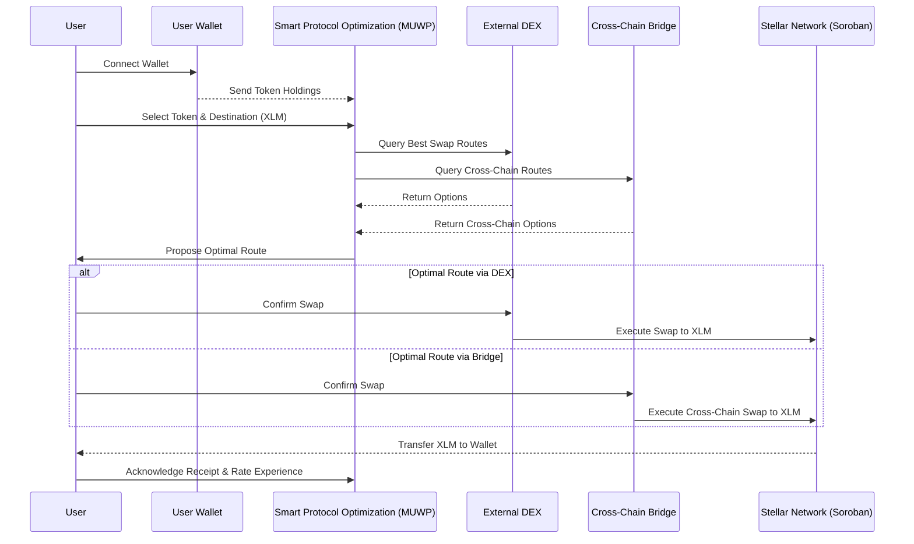

# Swap Sequence Diagram

MUWP seamlessly facilitates cross-chain token swaps to Stellar's XLM, leveraging user interactions, AI protocol optimization, and Soroban Smart Contracts for a streamlined experience.

---

## Detailed Step Explanation

| Step | Description |
|------|-------------|
| 1. Connect Wallet | Establishes a secure connection, enabling MUWP to access token holdings for swaps |
| 2. Send Token Holdings | Identifies assets available for swapping, essential for route optimization |
| 3. Select Token & Destination | User-driven decision process, initiating the swap |
| 4. Query DEX & Bridge | Gathers possible swap paths, covering both on-chain and cross-chain options |
| 5. Return Options | Enables the Smart Protocol to analyze and select the most efficient route |
| 6. Propose Optimal Route | Recommends the most cost-efficient and swift path to the user |
| 7. Confirm Swap | User consent before proceeding with the transaction |
| 8. Execute on Stellar | Soroban smart contracts execute the swap securely and efficiently |
| 9. Transfer XLM | XLM is delivered to the user's wallet — the successful conclusion of the swap |
| 10. Acknowledge & Rate | Feedback mechanism for continuous service improvement |
