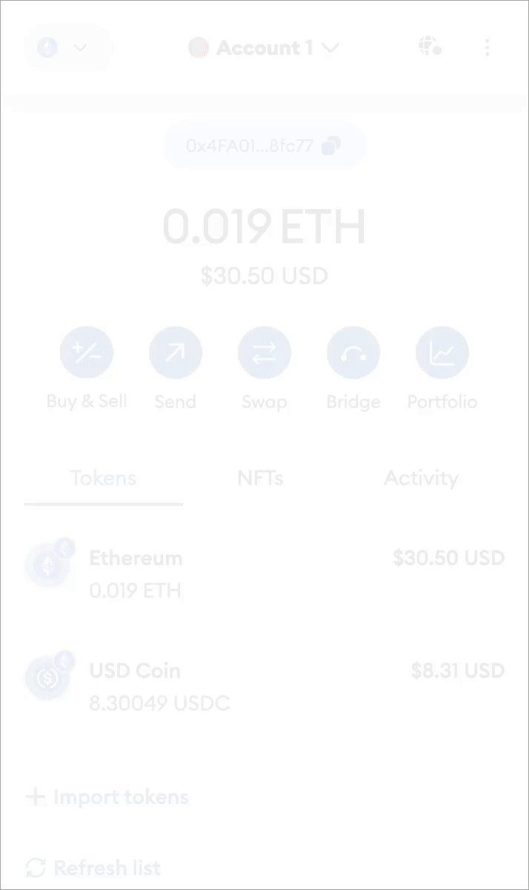

# Troubleshooting

If you encounter any issues while using the MUWPay dApp, follow this guide for troubleshooting.

#### Recovering Funds

Sometimes, due to network congestion, transactions may fail or go into an unresolved state. In these scenarios, you can easily recover your funds using the steps detailed below:

1. Open MUWPay dApp.
2. Navigate to the Transactions tab. This will bring up your transaction history.
3. Look for the transaction you need to troubleshoot or recover.
4. To the right of the transaction, identify three horizontal dots - the More Options button, and click on it to expand a dropdown menu.
5. Within the dropdown menu, click on Recover funds.

Doing so will give you a private key, that you can import in your Metamask wallet

<figure><figcaption>
Import account in Metamask
</figcaption></figure>

And you can paste the given key:

<figure><figcaption></figcaption></figure>
